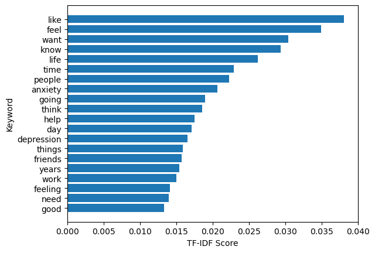
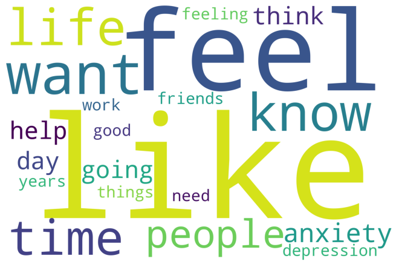
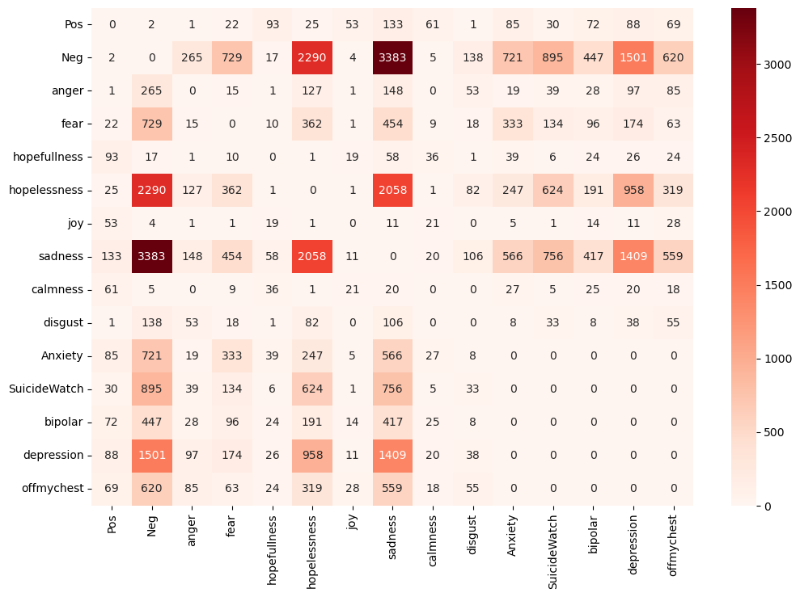

# Suicide Emotion Models
This is Jupyter files for training the 2 DNN models.

below is details of both models and results

## First model is used to predict Suicide labels

The labels are: Anxiety, Suicide Watch, Bipolar, Depression, Off my chest

**Model F1 score (Macro AVG) was 0.66, and Cross validation with 5 folds yielded Accuracy of 0.684 .**
## Second model is used to predict Polarity and emotions

The labels include: pos, neg, anger, fear, hopefullness, hopelessness, joy, sadness, disgust

**Model F1 score (Macro AVG) was 0.56, and Cross validation with 5 folds yielded Accuracy of 0.765 .**

*Calmness column was dropped during training due to low support ( rows )

## Keywords Extraction and correlation matrix analysis

Both keywords along with WordCloud and correlation matrix analysis graphs are shown below

### Keywords Extracted Graph

### WordCloud

### Correlation Matrix
